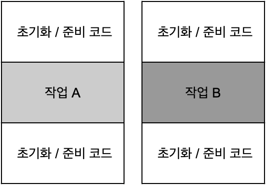
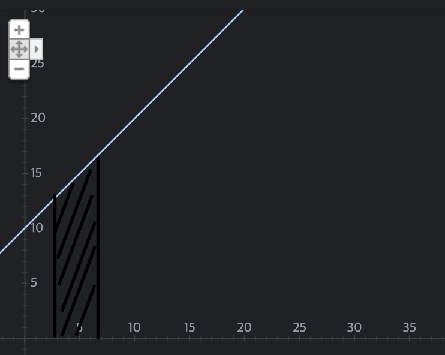

# 3. 람다 표현식


## 3.1 람다란 무엇인가?

**람다 표현식**은 메서드로 전달할 수 있는 익명 함수를 단순화 한 것이다. 람다 표현식에는 이름이 없지만, 파라미터 리스트, 바디, 반환 형식, 발생할 수 있는 예외 리스트는 가질 수 있다.


### 람다의 특징

 * **익명**
   * 보통의 메서드와 달리 이름이 없으므로 **익명** 이라고 표현한다. 

 * **함수**
   * 람다는 메서드처럼 특정 클래스에 종속되지 않으므로 함수라고 부른다. 하지만 메서드처럼 파라미터 리스트, 바디, 반환 형식, 가능한 예외 리스트를 포함한다.

 * **전달**
   * 람다 표현식을 메서드 인수로 전달하거나 변수로 저장할 수 있다.

 * **간결성**
   * 익명 클래스처럼 많은 자질구레한 코드를 구현할 필요가 없다.


**람다<sup>lambda</sup>** 라는 용어는 람다 **미적분학** 학계에서 개발한 시스템에서 유래한다.

람다를 이용하면 기존에 할 수 없는 일을 제공하는 것이 아니라 간결한 방식으로 코드를 전달할 수 있다.

```java
// 기존 코드
Comparator<Apple> byWeight = new Comparator<>() {

    @Override
    public int compare(Apple a1, Apple a2) {
        return a1.getWeight() - a2.getWeight();
    }
};

// 람다식 이용
Comparator<Apple> byWeight = (a1, a2) -> a1.getWeight() - a2.getWeight();
```

람다 표현식을 이용하면 compare 메서드의 바디를 직접 전달하는 것처럼 코드를 전달할 수 있다. 

### 람다 구성 요소

 * 파라미터 리스트: `(Apple a1, Apple a2)`
   * Comparator의 compare 메서드 파라미터 (사과 두 개)

 * 화살표: `->`
   * 화살표(->)는 람다의 파라미터 리스트와 바디를 구분한다.

 * 람다 바디: `(a1, a2) -> a1.getWeight() - a2.getWeight();`
   * 두 사과의 무게를 비교한다. 람다의 반환값에 해당하는 표현식이다.


### 자바 8의 유효한 람다 표현식
```java
// String 형식의 파라미터 하나를 가지며 int를 반환한다. 
// 람다 표현식에는 return 이 함축되어 있으므로 return 문을 명시적으로 사용하지 않아도 된다.
(String s) -> s.length()

// Apple 형식의 파라미터 하나를 가지며 boolean을 반환한다.
(Apple a) -> a.getWeight() > 150

// int 형식의 파라미터 두 개를 가지며 리턴값이 없다. (void 리턴)
(int x, int y) -> {
    System.out.println("Result : ");
    System.out.println(x + y);
}

// 파라미터가 없으며, int 42를 반환한다.
() -> 42

// Apple 형식의 파라미터 두 개를 가지며 int(두 사과의 무게 비교 결과)를 반환한다.
(Apple a1, Apple a2) -> a1.getWeight().compareTo(a2.getWeight())
```


### 람다의 기본 문법

 * `(parameteres) -> expression`

   > 표현식 스타일<sup>expression style</sup>

 * `(parameteres) -> { statements; }`

   > 블록 스타일<sup>block-style</sup>

람다 규칙에 맞지 않는 람다 표현식은 무엇인가?

```java
() -> {} // o

() -> "Raoul" // o

() -> { return "Mario"; } // o

(Integer i) -> return "Alan" + i; // x
// return은 흐름 제어문이다. 
// (Integer i) -> {return "Alan" + i;} ( O )

(String s) -> { "Iron Man"; } // x
// "Iron Man" 은 구문이 아니라 표현식이다.
// (String s) -> "Iron Man" ( O )
// (String s) -> {return "Iron Man";} ( O )
```


## 3.2 어디에, 어떻게 람다를 사용할까?

함수형 인터페이스라는 문맥에서 람다 표현식을 사용할 수 있다. 


### 3.2.1 함수형 인터페이스

**함수형 인터페이스**는 <u>정확히 하나의 추상 메서드를 지정</u>하는 인터페이스다. `Comparator`, `Runnable` 등

```java
public interface Predicate<T> {
    boolean Test (T t);
}

public interface Comparator<T> { // java.util.Comparator
    int compare(T o1, T o2);
}

public interface Runnable {	// java.lang.Runnable
    void run();
}

public interface ActionListener extends EventListener {	// java.awt.event.ActionListener
    void actionPerformed(ActionEvent e);
}

public interface Callable<V> {	// java.util.concurrent.Callable
    V call() throws Exception;
}

public interface PrivilegedAction<T> {	// java.security.PrivilegedAction
    T run();
}
```

> 인터페이스는 **디폴트 메서드**를 포함할 수 있다. 많은 디폴트 메서드가 존재해도 **추상 메서드가 오직 하나**면 함수형 인터페이스이다.

```java
// 다음 인터페이스 중 함수형 인터페이스는?

public interface Adder {
  int add(int a, int b);
}

public interface SmartAdder extends Adder {
  int add(double a, double b);
}

pulic interface Nothing {}

/*
· Adder만 함수형 인터페이스
· SmartAdder는 두 추상 메서드를 포함.
· Nothing은 추상메서드가 없음
*/
```

람다 표현식으로 함수형 인터페이스의 추상 메서드 구현을 직접 전달할 수 있으므로 **전체 표현식을 함수형 인터페이스의 인스턴스로 취급**할 수 있다.


```java
Runnable r1 = () -> System.out.println("Hello");
Runnable r2 = new Runnable() {
  @Override
  public void run() {
    System.out.println("World");
  }
}

public static void process(Runnable r) {
  r.run();
}

process(r1);	// "Hello" 출력
process(r2);	// "World" 출력
process(() -> System.out.println("Hello World"));	// 직접 전달된 람다표현식으로 "Hello World" 출력
```


### 3.2.2 함수 디스크립터

함수형 인터페이스의 추상 메서드 시그니처<sup>signature</sup>는 람다 표현식의 시그니처를 가리킨다. 람다 표현식의 시그니처를 서술하는 메서드를 **함수 디스크립터<sup>function descriptor</sup>** 라고 부른다. (ex. Runnable인터페이스는 인수와 반환값이 없는 시그니처)

#### 람다와 메서드 호출

* 정상표현식1

​	`process(() -> System.out.println("Hello Wolrd"));`

* 정상표현식2
  * 자바 언어 명세에는 void를 반환하는 메소드 호출과 관련한 특별한 규칙을 정하고 있다. 한 개의 void 메서드 호출은 중괄호로 감쌀 필요가 없다.

​	`process(() -> {System.out.println("Hello Wolrd");}); // 동작은 한다.` 


### @FunctionalInterface는 무엇인가?

`@FunctionalInterface`는 함수형 인터페이스임을 가리키는 어노테이션이다. 인터페이스를 선언했지만 실제 함수형 인터페이스가 아니면 컴파일러가 에러를 발생시킨다. 추상메서드가 한 개 이상이라면 "Multiple nonoverriding abstract methods found in interface Foo" 같은 에러가 발생할 수 있다.


## 3.3 람다 활용: 실행 어라운드 패턴

자원 처리에 사용하는 순환 패턴<sup>recurrent pattern</sup> 은 자원을 열고, 처리한 다음에, 자원을 닫는 순서로 이루어진다. 실제 자원을 처리하는 코드를 설정과 정리 두 과정이 둘러싸는 형태를 갖는다.

아래와 같은 형식의 코드를 **실행 어라운드 해턴 <sup>execute around pattern</sup>** 이라고 부른다.

> 자바 7에 새로 추가된 try-with-resource 구문을 사용하면 자원을 명시적으로 닫을 필요가 없다.

```java
public String processFile() throws IOException {
    try (BufferedReader br = new BufferedReader(new FileReader("data.txt"))) {
        return br.readLine(); // 실제 필요한 작업 
    }
}
```




### 3.3.1 1단계: 동작 파라미터화를 기억하라

현재 코드는 파일에서 한 번에 한 줄만 읽을 수 있다. 두 줄을 읽거나 가장 자주 사용되는 단어를 반환하려면? processFile의 동작을 파라미터화 하는 것이다.

```java
String result = processFile((br) -> br.readLine() + br.readLine());
```


### 3.3.2 2단계: 함수형 인터페이스를 이용해서 동작 전달

함수형 인터페이스 자리에 람다를 사용할 수 있다. 따라서 `BufferedReader -> String`과 `IOException`을 던질 수 있는 시그니처와 일치하는 함수형 인터페이스를 만들어야 한다.

```java
@FunctionalInterface
public interface BufferedReaderProcessor {
    String process(BufferedReader b) throws IOException;
}
```

정의한 인터페이스를 processFile 메서드의 인수로 전달할 수 있다.

```java
public String processFile(BufferedReaderProcessor p) throws IOException {
    ...
}
```


### 3.3.3 3단계: 동작 실행

이제 `BufferedReaderProcessor`에 정의된 `process` 메서드의 시그니처(BufferedReader -> String)와 일치하는 람다를 전달할 수 있다.

람다 표현식으로 함수형 인터페이스의 추상 메서드 구현을 직접 전달할 수 있으며, 전달된 코드는 함수형 인터페이스의 인스턴스로 전달된 코드와 같은 방식으로 처리한다.

```java
public String processFile(BufferedReaderProcessor p) throws IOException {
    try(BufferedReader br = new BufferedReader(new FileReader("data.txt"))) {
        return p.process(br); // BufferedReader 객체 처리
    }
}
```

### 3.3.4 4단계: 람다 전달

이제 람다를 이용해서 다양한 동작을 processFile 메서드로 전달할 수 있다.

1. 한 행을 처리하는 코드
```java
String oneLine = processFile(br -> br.readLine());
```

2. 두 행을 처리하는 코드
```java
String twoLine = processFile(br -> br.readLine() + br.readLine());
```

* 실행 어라운드 패턴을 적용하는 네 단계의 과정

  1.

  ```java
  public String processFile() throws IOException {
      try (BufferedReader br = new BufferedReader(new FileReader("data.txt"))) {
          return br.readLine();
      }
  }
  ```

  2.  

  ```java
  public interface BufferedReaderProcessor {
      String process(BufferedReader b) throws IOException;
  }
  
  public String processFile(BufferedReaderProcessor p) throws IOException {
      ...
  }
  ```

  3. 

  ```java
  public String processFile(BufferedReaderProcessor p) throws IOException {
      try(BufferedReader br = new BufferedReader(new FileReader("data.txt"))) {
          return p.process(br); // BufferedReader 객체 처리
      }
  }
  ```

  4.

  ```java
  String oneLine = processFile(br -> br.readLine());
  String twoLine = processFile(br -> br.readLine() + br.readLine());
  ```

  

## 3.4 함수형 인터페이스 사용

함수형 인터페이스의 추상메서드는 람다 표현식의 시그니쳐를 묘사한다. 함수형 인터페이스의 추상 메서드 시그니처를 **함수 디스크립터**<sup>function descriptor</sup>라고 한다.

다양한 람다 표현식을 사용하려면 공통의 함수 디스크립터를 기술하는 함수형 인터페이스 집합이 필요하다.

자바8 라이브러리 설계자들은 `java.util.function` 패키지로 여러 가지 새로운 함수형 인터페이스를 제공한다.

### 3.4.1 Predicate

`java.util.function.Predicate<T>` 인터페이스는 `test`라는 추상 메서드를 정의하며 test는 제네릭 형식 T의 객체를 인수로 받아 `boolean`을 반환한다. 따로 정의할 필요 없이 바로 사용할 수 있다.

```java
@FunctionalInterface
public interface Predicate<T> {
  boolean test(T t);
}

public <T> List<T> filter(List<T> list, Predicate<T> p) {
    List<T> results = new ArrayList<>();
    for (T t : list) {
        if (p.test(t)) {
            results.add(t);
        }
    } 
    return results;
}

Predicate<String> nonEmptyStringPredicate = (String s) -> !s.isEmpty();
List<String> nonEmpty = filter(listOfStrings, nonEmptyStringPredicate);
```


### 3.4.2 Consumer

`java.util.function.Consumer<T>` 인터페이스는 제네릭 형식 T 객체를 받아서 void를 반화하는 `accept`라는 추상메서드를 정의한다. T 형식의 객체를 인수로 받아서 어떤 동작을 수행하고 싶을 때 Consumer 인터페이스를 사용할 수 있다. 

```java
@FunctionalInterface
public interface Consumer<T> {
  void accept(T t);
}

public <T> void forEach(List<T> list, Consumer<T> c) {
    for (T t : list) {
        c.accept(t);
    }
}

forEach(
        Arrays.asList(1, 2, 3, 4, 5),
        i -> System.out.println(i) // Consumer의 accept 메서드를 구현하는 람다
);
```


### 3.4.3 Function

`java.util.function.Function<T, R>` 인터페이스는 제네릭 형식 T를 인수로 받아서 제네릭 형식 R 객체를 반화하는 추상 메서드 `apply`를 정의한다. 입력을 출력으로 매핑하는 람다를 정의할 때 Function 인터페이스를 활용할 수 있다.

```java
@FunctionalInterface
public interface Function<T, R> {
  R apply(T t);
}

public static <T, R> List<R> map(List<T> list, Function<T, R> f) {
    List<R> result = new ArrayList<>();
    for (T t : list) {
        result.add(f.apply(t));
    }
    return result;
}

// [7, 2, 6]
List<Integer> l = map(
        Arrays.asList("lambdas", "in", "action"),
        s -> s.length() // function의 apply 메서드를 구현하는 람다
);
```


### 기본형 특화

자바의 모든 형식은 참조형<sup>reference type</sup> 아니면 기본형<sup>primitive type</sup> 에 해당한다. 하지만 제네릭 파라미터에는 참조형만 사용할 수 있다. 

하지만 박싱과 언박싱 과정에서 비용이 소모된다. 오토박싱을 피하고자 특별한 함수형 인터페이스를 제공한다.

하지만 이런 변환 과정은 비용이 소모된다. 박싱한 값은 기본형을 감싸는 래퍼며 힙에 저장된다. 박싱한 값은 메모리를 더 소비하며 추가적인 탐색 과정이 필요하다.

자바 8에서는 기본형을 입출력으로 사용하는 상황에서 오토박싱 동작을 피할 수 있는 함수형 인터페이스를 제공한다.

```java
IntPredicate evenNumbers = i -> i % 2 == 0;
evenNumbers.test(1000); // true, 박싱 X

Predicate<Integer> oddNumbers = i -> i % 2 != 0;
oddNumbers.test(1000); // false, 박싱 O
```


| 함수형 인터페이스   | 함수 디스크립터   | 기본형 특화                                                  |
| ------------------- | ----------------- | ------------------------------------------------------------ |
| Predicate\<T>       | T -> boolean      | IntPredicate, DoublePredicate, LongPredicate                 |
| Consumer\<T>        | T -> void         | IntConsumer, DoubleConsumer, LongConsumer                    |
| Function<T, R>      | T -> R            | IntToDoubleFunction, IntToLongFunction, LongToDoubleFunction, LongToIntFunction, DoubleToIntFunction, DoubleToLongFunction, IntFunction\<R>, LongFunction\<R>, DoubleFunction\<R>, ToIntFunction\<T>, ToDoubleFunction\<T>, ToLongFunction\<T> |
| Supplier\<T>        | () -> T           | Boolean, IntSupplier, LongSupplier, DoubleSupplier           |
| UnaryOperator\<T>   | T -> T            | IntUnaryOperator, LongUnaryOperator, DoubleUnaryOperator     |
| BinaryOperator<T>   | (T, T) -> T       | IntBinaryOperator, LongBinaryOperator, DoubleBinaryOperator  |
| BiPredicate<L, R>   | (T, U) -> boolean |                                                              |
| BiConsumer<T, U>    | (T, U) -> void    | ObjIntConsumer\<T>, ObjLongConsumer\<T>, ObjDoubleConsumer\<T> |
| BiFunction<T, U, R> | (T, U) -> R       | ToIntBiFunction<T, U>, ToLongBiFunction<T, U>, ToDoubleBiFunction<T, U> |


### 예외, 람다, 함수형 인터페이스의 관계

함수형 인터페이스는 확인된 예외를 던지는 동작을 허용하지 않는다. 즉 예외를 던지는 람다 표현식을 만들려면 확인된 예외를 선언하는 함수형 인터페이스를 직접 정의하거나 람다를 **try/catch** 블록으로 감싸야 한다.

`IOException` 을  명시적으로 선언

```java
@FunctionalInterface
public interface BufferedReaderProcessor {

    String process(BufferedReader b) throws IOException;
}
```

함수형 인터페이스를 기대하는 API를 사용하고 있으며 직접 함수형 인터페이스를 만들기 어려운 상황이다. 명시적으로 확인된 예외를 잡자.

```java
Function<BufferedReader, String> f = br -> {
    try {
        return br.readLine();
    } catch (IOException e) {
        throw new RuntimeException(e);
    }
};
```


## 3.5 형식 검사, 형식 추론, 제약

람다 표현식 자체에는 람다가 어떤 함수형 인터페이스를 구현하는지의 정보가 포함되어 있지 않다. 람다 표현식을 더 잘 이해하기 위해서는 람다의 실제 형식을 파악해야 한다.

### 3.5.1 형식 검사

람다가 사용되는 콘텍스트<sup>context</sup> 를 이용해서 람다의 형식<sup>type</sup> 을 추론할 수 있다. 어떤 콘텍스트에서 기대되는 람다 표현식의 형식을 **대상 형식<sup>target type</sup>** 이라고 부른다. 

```java
List<Apple> heavierThan150g = filter(inventory, apple -> apple.getWeight() > 150);
```
위 코드의 형식 확인 과정은 아래와 같은 순서로 진행된다.

1. `filter` 메서드의 선언을 확인한다.
2. `filter` 메서드는 두 번째 파라미터로 `Predicate<Apple>` 형식을 기대한다.
3. `Predicate<Apple>`은 `test`라는 한 개의 추상 메서드를 정의하는 함수형 인터페이스이다.
4. `test` 메서드는 `Apple`을 받아 `boolean`을 반환하는 함수 디스크립터를 묘사한다.
5. `filter` 메서드로 전달된 인수는 이와 같은 요구사항을 만족해야 한다.

### 3.5.2 같은 람다, 다른 함수형 인터페이스

대상 형식<sup>target type</sup> 이라는 특징 때문에 같은 람다 표현식이더라도 호환되는 추상 메서드를 가진 다른 함수형 인터페이스로 사용될 수 있다.

```java
Callable<Integer> c = () -> 42;
PrivilegedAction<Integer> p = () -> 42;
```

### 다이아몬드 연산자

자바 7에서도 다이아몬드 연산자로 콘텍스트에 따른 제네릭 형식을 추론할 수 있다. 주어진 클래스 인스턴스 표현식을 두 개 이상의 다양한 콘텍스트에 사용할 수 있다. 이때 인스턴스 표현식의 형식 인수는 콘텍스트에 의해 추론된다.

```java
List<String> listOfStrings = new ArrayList<>();
List<Integer> listOfIntegers = new ArrayList<>();
```

### 3.5.3 형식 추론

대상 형식을 이용해서 함수 디스크립터를 알 수 있으므로 컴파일러는 람다의 시그니처도 추론할 수 있다. 

```java
List<Apple> greenApples = filter(inventory, apple -> Color.GREEN.equals(apple.getColor()));
```

생략하는 것과 안하는 것 중 어떤 방법이 좋은지 정해진 규칙은 없다. 개발자 스스로 어떤 코드가 가독성을 향상 시킬 수 있는지 결정해야 한다.

### 3.5.4 지역 변수 사용

람다표현식에서는 익명 함수가 하는 것처럼 **자유 변수<sup>free variable</sup>** (파라미터로 넘겨진 변수가 아닌 외부에서 정의된 변수)를 활용할 수 있다. 이와 같은 동작을 **람다 캡쳐링<sup>capturing lambda</sup>** 이라고 부른다.

```java
int portNumber = 1337;
Runnable r = () -> System.out.println(portNumber);
```

하지만 자유 변수에도 제약이 존재한다. 람다 표현식은 한 번만 할당할 수 있는 지역 변수를 캡처할 수 있다. (final)

```java
int portNumber = 1337;
// 람다에서 참고하는 지역 변수는 final로 선언되거나 실질적으로 final처럼 취급되어야 한다.
Runnable r = () -> System.out.println(portNumber);
portNumber = 31337;
```

### 지역 변수의 제약

1. 인스턴스 변수: 힙에 저장
2. 지역 변수: 스택에 저장

람다에서 지역 변수에 바로 접근할 수 있다는 가정하에 람다가 스레드에서 실행된다면 변수를 할당한 스레드가 사라져서 `변수 할당이 해제` 되었는데도 람다를 실행하는 스레드에서는 해당 변수에 `접근`하려 할 수 있다.

자바 구현에서는 원래 변수에 접근을 허용하는 것이 아니라 `자유 지역 변수의 복사본`을 제공한다. 복사본의 값이 바뀌지 않아야 하기 때문에 한 번만 값을 할당해야 한다는 제약이 생겼다.

### 클로저 

원칙적으로 클로저란 함수의 비지역 변수를 자유롭게 참조할 수 있는 함수의 인스턴스를 가리킨다. 람다와 익명 클래스 모두 메서드의 인수로 전달 될 수 있으며, 자신의 외부 영역의 변수에 접근할 수 있다. 

람다와 익명 클래스는 람다가 정의된 메서드의 지역 변수의 값은 바꿀 수 없다. 람다가 정의된 메서드의 지역 변숫값은 final 변수여야 한다. 덕분에 람다는 변수가 아닌 값에 국한되어 어떤 동작을 수행한다는 사실이 명확해진다.

 가변 지역 변수를 새로운 스레드에서 캡처할 수 있다면, 안전하지 않은 동작을 수행할 가능성이 생긴다.(인스턴스 변수는 스레드가 공유하는 힙에 존재하므로 특별한 제약이 없다.)


## 3.6 메서드 참조

메서드 참조를 이용하면 기존의 메서드 정의를 재활용해서 람다처럼 전달할 수 있다.

```java
Comparator<Apple> byWeight = (o1, o2) -> o1.getWeight() - o2.getWeight();
```

```java
Comparator<Apple> byWeight = Comparator.comparingInt(Apple::getWeight);
```

### 3.6.1 요약

메서드 참조는 특정 메서드만을 호출하는 람다의 축약형이다. 메서드명을 참조함으로써 **가독성을 높일 수 있다**.

메서드명 앞에 **구분자(::)**를 붙이는 방식으로 메서드 참조를 활용할 수 있다.

메서드 참조는 새로운 기능이 아니라 하나의 메서드를 참조하는 람다를 편리하게 표현할 수 있는 문법이다.

### 메서드 참조를 만드는 방법

1. 정적 메서드 참조
   *  `Integer::parseInt`
2. 다양한 형식의 인스턴스 메서드 참조
   * `String:length`
3. 기존 객체의 인스턴스 메서드 참조
   *  `expensiveTransaction::getValue`

```java
(String s) -> s.toUpperCase()	// 람다
String::toUpperCase	// 메서드 참조
  
List<String> str = Arrays.asList("a", "b", "A", "B");
str.sort((s1, s2) -> s1.compareToIgnoreCase(s2));
str.sort(String::compareToIgnoreCase);
```

#### 람다 표현식을 메서드 참조로 바꾸는 방법
```java
(args) -> ClassName.staticMethod(args)
ClassName::staticMethod

(arg0, rest) -> arg0.instanceMethod(rest)
ClassName::instanceMethod

(args) -> expr.oinstanceMethod(args)
expr::instanceMethod
```

컴파일러는 람다 표현식의 형식을 검사하던 방식과 비슷한 과정으로 메서드 참조가 주어진 함수형 인터페이스와 호환하는지 확인한다.


### 3.6.2 생성자 참조

`ClassName::new` 처럼 클래스명과 new 키워드를 이용해서 기존 생성자의 참조를 만들 수 있다.

```java
Supplier<Apple> c1 = Apple::new;
Apple a1 = c1.get();	// Supplier의 get 메서드를 호출해서 새로운 Apple 객체를 만들 수 있다.

Supplier<Apple> c1 = () -> new Apple();
Apple a1 = c1.get();
```

```java
Function<Integer, Apple> c2 = Apple::new;
Apple a2 = c2.apply(110);

Function<Integer, Apple> c2 (weight) -> new Apple(weight);
Apple a2 = c2.apply(110);
```

다음 코드에서 Integer를 포함하는 리스트의 각 요소를 정의한 map과 같은 메서드를 이용해서 Apple 생성자로 전달한다.

```java
List<Integer> weights = Arrays.asList(7, 3, 4, 10);
List<Apple> apples = map(weights, Apple::new);
```

```java
public static <T, R> List<R> map(List<T> list, Function<T, R> f) {
    List<R> result = new ArrayList<>();
    for (T t : list) {
        result.add(f.apply(t));
    }
    return result;
}
```

```java
BiFunction<Color, Integer, Apple> c3 = Apple::new;	// 생성자 참조
Apple a3 = c3.apply(Green, 110);	// 

static Map<String, Function<Integer, Fruit>> map = new HashMap<>();
static {
  map.put("apple", Apple::new);
  map.put("apple", Orange::new);
  // ...
}

public static Fruit giveMeFruit(String Fruit, Integer weight) {
  return map.get(fruit.toLowerCase()).apply(weight);
}
```


## 3.7 람다, 메서드 참조 활용하기

최종목표: `inventory.sort(comparing(Apple::getWeight));`

### 3.7.1 1단계: 코드 전달

```java
void sort(Comparator<? super E> c)	// sort 메서드의 시그니처
```

이 코드는 Comparator 객체를 인수로 받아 두 사과를 비교한다. 객체 안에 동작을 포함시키는 방식으로 다양한 전략을 전달할 수 있다. 

sort의 **동작은 파라미터화** 되었다. sort에 전달된 동작에 따라 sort의 동작이 달라진다.

```java
import java.util.Comparator;

public class AppleComparator implements Comparator<Apple> {
    @Override
    public int compare(Apple o1, Apple o2) {
        return o1.getWeight() - o2.getWeight();
    }
}
```

### 3.7.2 2단계: 익명 클래스 사용

```java
inventory.sort(new Comparator<>() {
    @Override
    public int compare(Apple o1, Apple o2) {
        return o1.getWeight() - o2.getWeight();
    }
});
```

### 3.7.3 3단계: 람다 표현식 사용

```java
inventory.sort((o1, o2) -> o1.getWeight() - o2.getWeight());
```

### 3.7.4 4단계 메서드 참조 사용

```java
inventory.sort(Comparator.comparingInt(Apple::getWeight));
```


## 3.8 람다 표현식을 조합할 수 있는 유용한 메서드

자바 8 API의 몇몇 함수형 인터페이스는 다양한 유틸리티 메서드를 포함한다. 예를 들어Comparator, Fuction, Predicate 같은 함수형 인터페이스는 람다 표현식을 조합할 수 있도록 유틸리티 메서드를 제공한다. 두 프레디케이트를 조합해서 or 연산을 수행하는 커다란 프레디케이트를 만들 수 있다. 여기서 등장하는 것이 바로 **디폴트 메서드**<sup>default method</sup>이다. 

### 3.8.1 Comparator 조합

```java
Comparator<Apple> c = Comparator.comparing(Apple::getWeigt);
```

#### 역정렬

```java
inventory.sort(Comparator.comparingInt(Apple::getWeight).reversed());
```

#### Comperator 연결

```java
inventory.sort(Comparator.comparingInt(Apple::getWeight)
                .reversed()
                .thenComparing(Apple::getCountry));
```

### 3.8.2 Predicate 조합

Predicate 인터페이스는 복잡한 predicate 생성을 위해 negate, and, or 세 가지 메서드를 제공한다.

```java
// 기존 Predicate 객체의 결과를 반전시킨 객체
Predicate<Apple> notRedApple = redApple.negate();
```

```java
Predicate<Apple> redAndHeavyApple = redApple.and(apple -> apple.getWeight() > 150);
```

```java
// 빨간 사과 또는 그냥 녹색 사과
Predicate<Apple> redAndHeavyAppleOrGreen = 
    redApple.and(apple -> apple.getWeight() > 150)
            .or(apple -> Color.GREEN.equals(a.getColor())); 
```

### 3.8.3 Function 조합

Function 인터페이스는 andThen, compose 두 가지 디폴트 메서드를 제공한다.

```java
Function<Integer, Integer> f = x -> x + 1;
Function<Integer, Integer> g = x -> x * 2;
Function<Integer, Integer> h = f.andThen(g); // g(f(x)) || (g · f (x))
int result = h.apply(1); // 4를 반환
```

```java
Function<Integer, Integer> f = x -> x + 1;
Function<Integer, Integer> g = x -> x * 2;
Function<Integer, Integer> h = f.compose(g); // f(g(x)) || (f · g (x))
int result = h.apply(1); // 3를 반환
```


## 3.9 비슷한 수학적 개념

### 3.9.1 적분

$$
f(x) = x + 10  
\newline
\newline
\int_3^7f(x)\,dx
$$



```java
integerate(f, 3, 7);	// ( O )

integerate(x + 10, 3, 7)	// ( X )
// X의 범위가 불분명하며, x + 10이라는 값을 전달하게 되기 때문에 잘못된 식이다.
```

### 3.9.2 자바8 람다로 연결

​	자바8에서는 `(double x) -> x + 10`같은 람다 표현식을 사용할 수 있다.

```java
integrate((double x) -> f(x), 3, 7);

// C가 정적 메서드 f를 포함하는 클래스라고 가정하면 메서드 참조를 이용하여 간단하게 만들 수 있다.
integrate(C::f, 3, 7);

public double integrate(DoubleUnaryOperator f, double a, double b) {
  return (f.applyAsDouble(a) + f.applyAsDouble(b)) * (b - a) / 2.0;
}
```

참고로 수학처럼 f(a)라고 표현할 수 없고 f.apply(a)라고 구현했는데, 이는 자바가 진정으로 함수를 허용하지 않고 모든 것을 객체로 여기는 것을 포기할 수 없기 때문이다.


## 3.10 마치며

 * **람다 표현식** 은 익명 함수의 일종이다. 이름이 없고, 파라미터 리스트, 바디, 반환 형식을 가지며 예외를 던질 수 있다. 
 * **함수형 인터페이스** 는 하나의 추상 메서드만을 정의하는 인터페이스이다. 
 * 함수형 인터페이스를 기대하는 곳에서만 람다 표현식을 사용할 수 있다.
 * 람다 표현식을 이용해서 함수형 인터페이스의 추상 메서드를 즉성으로 제공할 수 있으며 **람다 표현식 전체가 함수형 인터페이스의 인스턴스로 취급된다.**
 * **java.util.function** 패키지는 자주 사용하는 다양한 함수형 인터페이스를 제공한다. 또한 제네릭 함수형 인터페이스와 관련한 박싱 동작을 피할 수 있는 기본형 특화 인터페이스도 제공된다.
 * 실행 어라운드 패턴(자원 할당, 자원 정리 등 코드 중간에 실행해야 하는 메서드에 꼭 필요한 코드)을 람다와 활용하면 유연성과 재사용성을 추가로 얻을 수 있다.
 * 람다 표현식의 기대 형식<sup>type expected</sup>을 대상 형식<sup>target type</sup>이라고 한다.
 * 메서드 참조를 이용하면 기존의 메서드 구현을 재사용하고 직접 전달할 수 있다.
 * Comparator, Predicate, Function 같은 함수형 인터페이스는 람다 표현식을 조합할 수 있는 다양한 디폴트 메서드가 제공된다.

## References

라울-게이브리얼 우르마, 마리오 푸스코, 앨런 마이크로프트, 『Modern Java in Action』, 한빛미디어(2019), p87-131.

