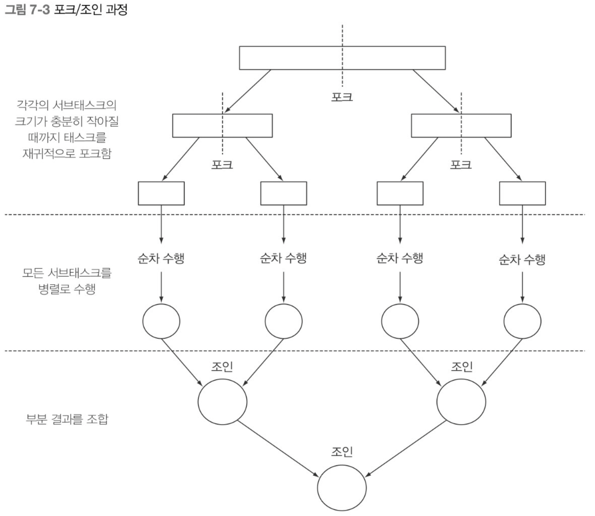
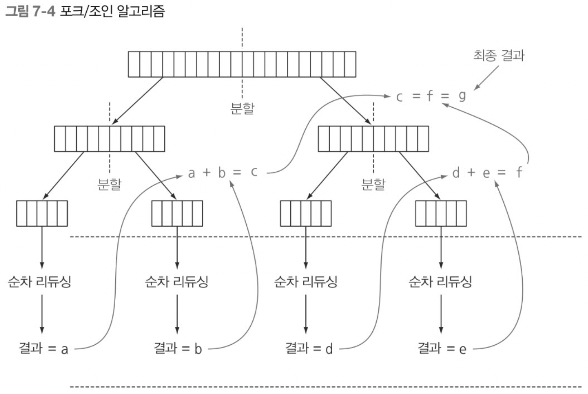
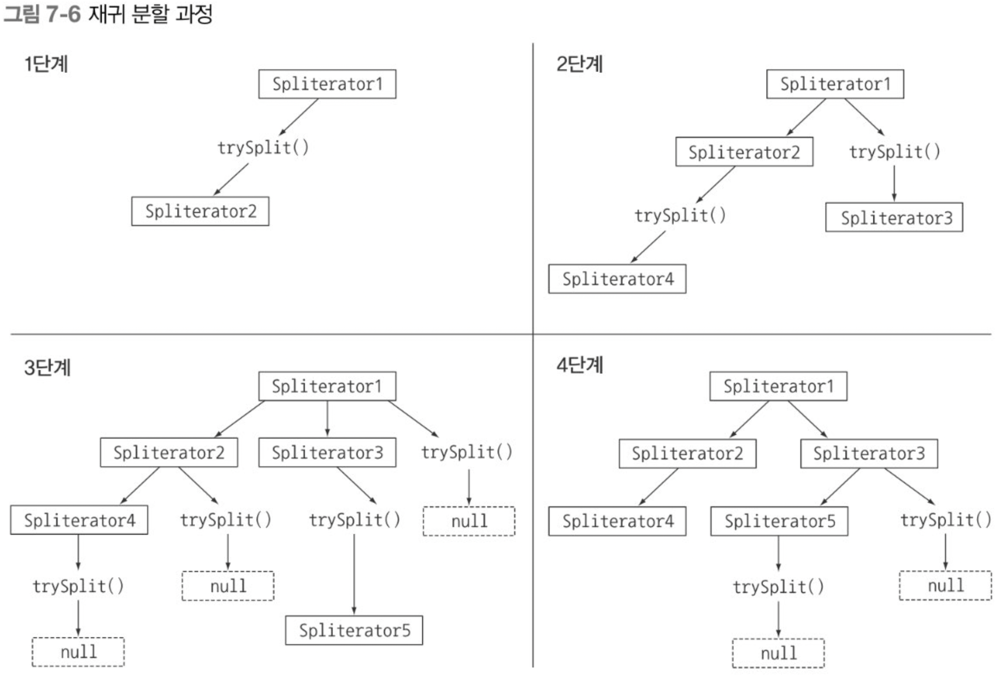

# 7. 병렬 데이터 처리와 성능

## 7.1 병렬 스트림

컬렉션에 parallelStream을 호출하면 **병렬 스트림**<sup>parallel stream</sup>이 생성된다. 병렬 스트림이란 각각의 스레드에서 처리할 수 있도록 스트림 요소를 여러 청크로 분할한 스트림이다. 따라서 병렬 스트림을 이용하면 모든 멀티코어 프로세서가 각각의 청크를 처리하도록 할당할 수 있다.

숫자 n을 인수로 받아서 1부터 n까지의 모든 숫자의 합계를 반환하는 메서드를 구현한다고 가정한다. 아래는 무한 스트림을 활용하여 리듀싱 작업을 수행하도록 구현하였다.

```java
public long sequentialSum(long n) {
    return Stream.iterate(1L, i -> i + 1)  // 무한 자연수 스트림 생성
        .limit(n)	// n개 이하로 제한
        .reduce(0L, Long::sum);	// 모든 숫자를 덯는 스트림 리듀싱 연산
}
```

전통적인 Java에서는 다음과 같이 반복문으로 구현할 수 있다.

```java
public long iterativeSum(long n) {
    long result = 0;
    for (long i = 1L; i <= n; i++) {
        result += i;
    }
    return result;
}
```

n이 커진다면 이 연산을 병렬로 처리하는 것이 좋을 것이다. 어디부터, 결과 변수의 동기화, 스레드의 개수 등 병렬 ㅅ트림을 이용하면 모든 문제가 해결된다.

### 7.1.1 순차 스트림을 병렬 스트림으로 변환하기

순차 스트림에서 `parallel` 메서드를 호출하면 기존 연산이 병렬로 처리된다.

```java
public long parallelSum(long n) {
    return Stream.iterate(1L, i -> i + 1)
        .limit(n)
        .parallel()
        .reduce(0L, Long::sum);
}
```

이제 스트림은 여러 청크로 분할되어 처리된다. 마지막 리듀싱 연산으로 생성된 부분 결과를 다시 리듀싱 연산으로 합쳐서 도출한다.

사실 순차 스트림에서 단순히 parallel을 호출해도 스트림 자체에는 아무 변화도 일어나지 않는다. 내부적으로 parallel을 호출하면 이후 연산이 병렬로 수행해야 함을 의미하는 불리언 플래그가 설정된다. 

```java
stream.parallel()
      .filter(...)
      .sequantial()
      .map(...)
      .parallel()
      .reduce();
```

위 예제를 보면 `parallel`과 `sequantial`중 최종적으로 호출된 메서드가 전체 파이프라인에 영향을 미친다. 마지막으로 호출된 메서드는 parallel이므로 **파이프라인은 전체적으로 병렬 실행된다**.

### 병렬 스트림에서 사용하는 스레드 풀 설정
병렬 스트림은 내부적으로 ForkJoinPool을 사용한다. 기본적으로 ForkJoinPool은 프로세서 수, 즉 `Runtime.getRuntime()`, `avaliableProcessors()`가 반환하는 값에 상응하는 스레드를 갖는다.

특별한 이유가 없다면 ForkJoinPool의 기본값을 그대로 사용할 것을 권장한다.

### 7.1.2 스트림 성능 측정
성능을 최적화 할 때는 무조건 측정해야한다.

```java
@BenchmarkMode(Mode.AverageTime)	// 벤치마크 대상 메서드를 실행하는 데 걸린 평균 시간 측정
@OutputTimeUnit(TimeUnit.MILLISECONDS)	// 밀리초 단위로 출력
@Fork(2, jvmArgs={"-Xms4G", "-Xmx4G"})	// 4G의 힙 공간을 제공한 환경에서 벤치마크 두 번 실행
public calss ParallelStreamBenchmark {
	private static final long N = 100_000_000L;
	
	@Benchmark	// 벤치마크 대상 메서드
	public long sequentialSum(){
		return Stream.iterate(1L, i -> i + 1)
					.limit(N)
					.reduce(0L, Long::sum);
	}

	@Benchmark	// 벤치마크 대상 메서드
	public long iterativeSum(){
		long result = 0;
		for (long i = 1L; i <= N; i++) {
			result += i;
		}
		return result;
	}

	@Benchmark
	public long parallelSum() {
  		...
	}

	@TearDowm(Level.Invocation) // 매 번 벤치마크를 실행한 다음에는 가비지 컬렉터 동작 시도
	public void tearDown() {
		System.gc();
	}
}
```

`sqeuntialSum()`보다 전통적인 for문 (`iterativeSum()`)이 저수준으로 동작하고, 박싱 언박싱이 없어 더 빠르다. 하지만 `parallelSum()` 은 언박싱과, 반복작업은 병렬로 수행할 수 있는 독립단위로 나누기 어렵기 때문에 훨씬 느리다.
이전 연산의 결과에 따라 다음 함수의 입력이 달라지기 때문에 iterate연산을 청크로 분할하기 어렵다. 결국 병렬수행이지만, 순차처리와 차이가 없고, 스레드를 할당하는 오버헤드만 증가했다. 
parallel 메서드의 내부 과정을 이해해야한다.

#### 더 특화된 메서드 사용
`LongStream.rangeClosed`
* 기본형 long을 사용하므로 박싱/언박싱 오버헤드가 사라진다.
* 쉽게 청크로 분할할 수 있는 숫자 범위를 생산한다. 1-20 -> 1-5, 6-10, 11-15, 16-20


```java
public long rangedSum() {
    return LongStream.rangeClosed(1, N)
						.reduce(0L, Long::sum);
}

public long parallelRangedSum() {
    return LongStream.rangeClosed(1, N)
						.parallel()
						.reduce(0L, Long::sum);
}
```

병렬화가 완전 공짜는 아니다. 병렬화를 이용하려면 스트림을 재귀적으로 분할해야 하고, 각 서브스트림을 서로 다른 스레드의 리듀싱 연산으로 할당하고, 결과를 하나의 값으로 합쳐야 한다. 멀티코어 간의 데이터 이동은 생각보다 비싸다. 코어 간에 데이터 저송 시간보다 훨씬 오래 걸리는 작업만 병렬로 다른 코어에서 수행하는 것이 바람직하다. 

또한 상황에 따라 쉽게 병렬화를 이용할 수 있거나 아니면 아예 병렬화를 이용할 수 없을 때도 있다. 스트림을 병렬화해서 코드 실행 속도를 빠르게 하고 싶으면 항상 병렬화를 올바르게 사용하고 있는지 확인해야 한다.

|Benchmark|Mode|Cnt|Score|Error|Units|
|:--|--|--|--|--|--|
|PararellStreamBenchmark.sequentialSum|avgt|40|121.843|3.062|ms\op|
|PararellStreamBenchmark.iterativeSum|avgt|40|3.278|0.192|ms/op|
|PararellStreamBenchmark.parallelSum|avgt|40|604.059|55.288|ms/op|
|PararellStreamBenchmark.rangedSum|avgt |40|5.315|0.285|ms/op|
|PararellStreamBenchmark.parallelRangedSum|avgt|2.677|0.214|ms/op|


### 7.1.3 병렬 스트림의 올바른 사용법

병렬 스트림을 잘못 사용하면서 발생하는 많은 문제는 공유된 상태를 바꾸는 알고리즘을 사용할 때 일어난다. 

```java
public long sideEffect(long n) {
	Accumulator accumulator = new Accumulator();
	LongStream.rangeClosed(1, n).forEach(accumulator::add);
	return accumulator.total;
}

public class Accumulator {
    public long total = 0;

    public void add(long value) {
        total += value;
    }
}
```

위 코드는 순차 실행할 수 있도록 구현되어 있어 병렬로 실행하면 큰 일이 난다. 특히 `total`에 접근할 때 마다 데이터 레이스 문제가 일어난다. 동기화로 문제를 해결하다보면 결국 병렬화라는 특성이 없어져 버릴 것이다.

```java
public long sideEffectParallelSum(long n) {
	Accumulator accumulator = new Accumulator();
	LongStream.rangeClosed(1, n)
			.parallel()
			.forEach(accumulator::add);
	return accumulator.total;
}
```
코드를 실행하면 올바른 결과값이 나오지 않는다. 여러 스레드에서 동시에 누적자 (`total += value`)를 실행하면 이런 문제가 발생한다.  `total += value`는 아토믹 연산이 아니기 때문이다.
`forEach`내부에서 `add` 메서드를 호출하면서 이 같은 문제가 발생한다. 
상태 공유에 따른 부작용을 피해야 한다.

### 7.1.4 병렬 스트림 효과적으로 사용하기
 * 확신이 서지 않으면 측정한다. 순차 스트림과 병렬 스트림 중 어떤 것이 좋을지 모르겠다면 적절한 벤치마크로 직접 성능을 측정하는 것이 바람직하다.
 * 박싱을 주의한다. 자동 박싱과 언박싱은 성능을 크게 저하시킬 수 있다. Java 8은 박싱 동작을 피할 수 있도록 기본형 특화 스트림(IntStream, LongStream, DoubleStream)을 제공한다.
 * 순차 스트림보다 병렬 스트림에서 성능이 떨어지는 연산이 있다. 특히 limit이나 findFirst처럼 요소의 순서에 의존하는 연산을 병렬 스트림에서 수행하려면 비싼 비용을 치뤄야 한다.
 * 스트림에서 수행하는 전체 파이프라인 연산 비용을 고려한다. 처리해야 할 요소 수가 N이고 하나의 요소를 처리하는 데 드는 비용을 Q라 하면 전체 스트림 파이프라인 처리 비용을 N * Q로 예상할 수 있다. Q가 높아진다는 것은 병렬 스트림으로 성능을 개선할 수 있는 가능성을 의미한다.
 * 소량의 데이터에서 병렬 스트림이 도움되지 않는다. 소량의 데이터를 처리하는 상황에서는 병렬화 과정에서 생기는 부가 비용을 상쇄할 수 있을 만큼의 이득을 얻지 못한다.
 * 스트림을 구성하는 자료구조가 적절한지 확인한다. ArrayList를 LinkedList보다 효율적으로 분할할 수 있다. 
 * 스트림의 특성과 파이프라인의 중간 연산이 스트림의 특성을 어떻게 바꾸는지에 따라 분해 과정의 성능이 달라질 수 있다. 
 * 최종 연산의 병합 과정 비용을 살펴본다. 병합 과정의 비용이 비싸다면 병렬 스트림으로 얻은 성능의 이익이 서브스트림의 부분 결과를 합치는 과정에서 상쇄될 수 있다.

#### 스트림 소스의 병렬화 친밀도

|소스|분해성|
|--|--|
|ArrayList|훌륭함|
|LinkedList|나쁨|
|IntStream.range|홀륭함|
|Stream.iterate|나쁨|
|HashSet|좋음|
|TreeSet|좋음|

 병렬 스트림이 수행되는 내부 인프라구조도 살펴봐야 한다. Java 7에서 추가된 포크/조인 프레임워크로 병렬 스트림이 처리된다.

## 7.2 포크/조인 프레임워크
포크/조인 프레임워크는 병렬화할 수 있는 작업을 재귀적으로 작은 작업으로 분할한 다음에 서브태스크 각각의 결과를 합쳐서 전체 결과를 만들도록 설계되었다. 

### 7.2.1 RecursiveTask 활용

스레드 풀을 이용하려면 `RecursiveTask<R>`의 서브 클래스를 만들어야 한다.
> R은 병렬화된 태스크가 생성하는 결과 형식 또는 결과가 없을 때는 `RecursiveAction` 형식이다.  

```java
protectec abstract R compute();
```
 
 * `compute()` 메서드는 태스크를 서브태스크로 분할하는 로직과 더 이상 분할할 수 없을 때 개별 서브태스크의 결과를 생산할 알고리즘을 정의한다. 따라서 대부분의 `compute` 메서드는 아래와 같은 의사코드 형식을 유지하고 있다.

```
if (태스크가 충분히 작거나 더 이상 분할할 수 없으면) {
    순차적으로 태스크 계산
} else {
    태스크를 두 서브태스크로 분할
    태스크가 다시 서브태스크로 분할되도록 이 메서드를 재귀적으로 호출한다.
    모든 서브태스크의 연산이 완료될 때까지 기다린다.
    각 서브태스크의 결과를 합친다.
}
```




#### 포크/조인 프레임워크를 이용한 병렬 합계 수행 예제
```java
public class ForkJoinSumCalculator extends java.util.concurrent.RecursiveTask<Long> {
	private final long[] numbers;	// 더할 숫자 배열
  private final int start;	// 이 서브태스크에서 처리할 배열의 초기위치와 최종위치
  private final int end;
  public static final long THRESHOLD = 10_000;	// 이 값 이하의 서브태스크는 더 이상 분할할 수 없다.

  public ForkJoinSumCalculator(long[] numbers){
		// 메인 태스크의 서브태스크를 재귀적으로 만들 때 사용할 공개 생성자
		this(numbers, 0, numbers.length);
  }

	private ForkJoinSumCalculator(long[] numbers, int start, int end) {
		// 메인 태스크의 서브태스크를 재귀적으로 만들 때 사용할 공개 생성자			this.numbers = numbers;
      this.start = start;
      this.end = end;
    }

	@Override
	protected Long compute() {
	// Recursive Task의 추상 메서드 오버라이드
		int length = end - start;	// 더할 배열의 길이
      if (length <= THRESHOLD) {	// 기준값과 같거나 작으면 순차적으로 결과 계산
		return computeSequentially();
		}

  // 배열의 첫 번째 절반을 더하도록 서브태스크를 생성한다.
	ForkJoinSumCalculator leftTask = new ForkJoinSumCalculator(numbers, start, start + length / 2);
		// ForkJoinPool의 다른 스레드로 새로 생성한 태스크를 비동기로 실행한다.
		leftTask.fork();
		// 배열의 나머지 절반을 더하도록 서브태스크 생성
      ForkJoinSumCalculator rightTask = new ForkJoinSumCalculator(numbers, start + length / 2, end);
		// 두 번째 서브태스크를 동기 실행한다. 추가 분할 발생 가능
      Long rightResult = rightTask.compute();
		// 첫 번째 서브태스크의 결과를 읽거나 결과가 없으면 기다린다.
      Long leftResult = leftTask.join();
		// 두 서브태스크의 결과를 조합한 값이 이 태스크의 결과다.
      return leftResult + rightResult;
	}

  private long computeSequentially() {
	// 더 분할할 수 없을 때 서브태스크의 결과를 계산하는 단순 알고리즘
      long sum = 0;
      for (int i = start; i < end; i++) {
          sum += numbers[i];
      }
      return sum;
	}
}
```
 
n 까지의 자연수 덧셈 작업을 병렬로 수행하는 방법을 더 직관적으로 보여준다. 생성자로 원하는 수의 배열을 넘겨줄 수 있다.
```java
public static long forkJoinSum(long n) {
    long[] numbers = LongStream.rangeClosed(1, n).toArray();
    ForkJoinTask<Long> task = new ForkJoinSumCalculator(numbers);
    return new ForkJoinPool().invoke(task);
}
```

`ForkJoinPool`의 `invoke 메서드`의 반환값은 `ForkJoinSumCaculator`에서 정의한 태스크의 결과가 된다.

 일반적인 애플리케이션에서는 둘 이상의 ForkJoinPool을 사용하지 않는다. 소프트웨어의 필요한 곳에서 언제든 가져다 쓸 수 있도록 한 번만 인스턴스화해서 정적 필드에 싱글턴으로 저장한다. 
Runtime.availableProcessors의 반환값으로 풀에 사용할 스레드 수를 결정한다.

#### ForkJoinSumCalculator 실행
`ForkJoinSumCalculator`를 `ForkJoinPool`로 전달하면 풀의 스레드가 `compute`메서드를 실행하면서 작업을 수행한다. compute메서드는 병렬로 실행할 수 있을 만큼 태스크의 크기가 충분히 작아졌는지 확인하며, 아직 태스크의 크기가 크다고 판단되면 숫자 배열을 반으로 분할해서 두 개의 새로운 `ForkJoinSumCalculator`로 할당한다. 이 과정이 재귀적으로 반복된다.




### 7.2.2 포크/조인 프레임워크를 제대로 사용하는 방법

 * join 메서드를 태스크에 호출하면 태스크가 생산하는 결과가 준비될 때 까지 호출자를 블록 시킨다. 두 서브태스크가 모두 시작된 다음에 join을 호출해야 한다.
 * RecursiveTask 내에서 ForkJoinPool의 invoke 메서드를 사용하지 말아야 한다. 순차 코드에서 병렬 계산을 시작할 때 invoke를 사용한다.
 * 서브태스크에 fork 메서드를 호출해서 ForkJoinPool의 일정을 조절할 수 있다. 한쪽 작업에는 fork를 호출하는 것보다 compute를 호출하는 것이 효율적이다. 두 서브태스크의 한 태스크에는 같은 스레드를 재사용할 수 있으므로 풀에서 불필요한 태스크를 할당하는 오버헤드를 피할 수 있다.
 * 포크/조인 프레임워크를 이용하는 병렬 계산은 디버깅이 어렵다. 이유는 fork라고 불리는 다른 스레드에서 compute를 호출하기 때문에 스택 트레이스가 도움되지 않는다.
 * 멀티코어에 포크/조인 프레임워크를 사용하는 것이 순차 처리보다 무조건 빠르지 않다. 병렬 처리로 성능 개선을 위해서는 태스크를 여러 독립된 서브태스크로 분할할 수 있어야 한다.  컴파일러 최적화는 병렬버전보다 순차버전에 집중될 수 있다.


### 7.2.3 작업 훔치기
각각의 서브태스크의 작업완료 시간은 외부 요인으로 인해 크게 달라질 수 있다. 포크/조인 프레임워크에서는 **작업 훔치기**<sup>work stealing</sup>을 통해 불균형을 해결한다. 각각의 스레드는 자신에게 할당된 태스크를 포함하는 이중 연결 리스트를 참조하면서 작업이 끝날 때 마다 큐의 헤드에서 다른 태스크를 가져와 작업을 처리한다. 하지만 어떤 스레드가 작업이 일찍 종료되면 유휴상태가 되지 않고, 다른 스레드 큐의 꼬리에서 작업을 훔쳐온다.

## 7.3 Spliterator 인터페이스
`Spliterator`는 분할할 수 있는 반복자라는 뜻이다. 
`Spliterator`는 `Iterator` 처럼 요소 탐색 기능을 제공하고 병렬 작업에 특화되어있다. Spliterator가 어떻게 동작하는지 이해한다면 병렬 스트림 동작을 이해하는데 큰 도움이 된다.

Java 8은 컬렉션 프레인워크에 포함된 모든 자료구조에 사용할 수 있는 디폴트 Spliterator 구현을 제공한다.

>  Spliterator 인터페이스  
```java
public interface Spliterator<T> {
    boolean tryAdvance(Consumer<? super T> action);
    Spliterator<T> trySplit();
    long estimateSize();
    int characteristics();
}
```
 
* `<T>`는 탐색하는 요소의 형식을 가리킨다.
* `tryAdvance`메서드는 Spliterator의 요소를 하나씩 순차적으로 소비하면서 탐색해야 할 요소가 남아 있으면 true를 반환한다.
* `trySplit`메서드는 Spliterator의 일부 요소를 분할해서 두 번째 Spliterator를 생성하는 메서드이다.
* `estimateSize`: 탐색해야 할 요소 수 정보를 제공한다.

### 7.3.1 분할 과정
스트림을 여러 스트림으로 분할하는 과정은 재귀적으로 일어난다.
`trySplit`결과가 null이 될 때까지 `trySplit`을 호출하며 `Spliterator`를 생성한다.


#### Spliterator 특성

Characteristics 메서드는 Spliterator 자체의 특성 집합을 포함하는 int를 반환한다. Spliterator는 이것을 참고하여 더 잘 제어하고 최적화한다.

#### Spliterator 특성
|특성|의미|
|--|--|
|ORDERED|리스트처럼 요소에 정해진 순서가 있으므로 Spliterator는 요소를 탐색하고 분할할 때 이 순서에 유의해야 한다.|
|DISTINCT|x, y 두 요소를 방문했을 때 x.equals(y)는 항상 false를 반환한다.|
|SORTED|탐색된 요소는 미리 정의된 정렬 순서를 따른다.|
|SIZED|크기가 알려진 소스로 Spliterator를 생성했으므로 estimatedSize()는 정확한 값을 반환한다.|
|NON-NULL|탐색하는 모든 요소는 null이 아니다.|
|IMMUTABLE|이 Spliterator의 소스는 불변이다. 즉 요소를 탐색하는 동안 요소를 추가하거나, 삭제하거나, 고칠 수 없다.|
|CONCURRENT|동기화 없이 Spliterator의 소스를 여러 스레드에서 동시에 고칠 수 있다.|
|SUBSIZED|이 Spliterator 그리고 분할되는 모든 Spliterator는 SIZED 특성을 갖는다.|

### 7.3.2 커스텀 Spliterator 구현하기

#### 반복형으로 단어 수를 세는 메서드
```java
public static int countWordsIteratively(String s) {
    int counter = 0;
    boolean lastSpace = true;
    for (char c : s.toCharArray()) {	// 문자열의 모든 문자를 하나씩 탐색한다.
        if (Character.isWhitespace(c)) {
            lastSpace = true;
        } else {
            if (lastSpace) counter++;	// 문자를 하나씩 탐색하다 공백을 만나면 지금까지 탐색한 문자를 단어로 간주하여 단어 수를 증가
            lastSpace = false;
        }
    }
    return counter;
}
```

```java
public static void main(String[] args) {
    final String SENTENCE =
        "Nel    mezzo del cammin di nostra vita " +
        "mi ritrovai in una selva oscura " +
        "ch     la dritta via era smarrita ";

    System.out.println("Found " + countWordsIteratively(SENTENCE) + " words");
}
```

```
Found 19 words
```
반복형 대신 함수형을 이용하면 직접 스레드를 동기화하지 않고도 병렬 스트림으로 작업을 병렬화할 수 있다.

#### 함수형으로 단어 수를 세는 메서드 재구현하기
스트림은  int, long, double 기본형만 제공하므로 Stream<Character>를 사용해야 한다.
```java
public class WordCounter {
    private final int counter;
    private final boolean lastSpace;

    public WordCounter(int counter, boolean lastSpace) {
        this.counter = counter;
        this.lastSpace = lastSpace;
    }

    public WordCounter accumulate(Character c) {
	  // 반복 알고리즘처럼 accumulate 메서드는 문자열의 문자를 하나씩 탐색
        if (Character.isWhitespace(c)) {
            return lastSpace ? this : new WordCounter(counter, true);
        } else {
			  // 공백을 만나면 단어 수 증가
            return lastSpace ?
                new WordCounter(counter + 1, false) :
                this;
        }
    }

    public WordCounter combine(WordCounter wordCounter) {
        return new WordCounter(counter + wordCounter.counter, wordCounter.lastSpace);
    }

    public int getCounter() {
        return counter;
    }
}
```

```java
private static int countWords(Stream<Character> stream) {
    WordCounter wordCounter = stream.reduce(new WordCounter(0, true),
                                                WordCounter::accumulate,
                                                WordCounter::combine);

    return wordCounter.getCounter();
}
```

```java
public static void main(String[] args) {
    Stream<Character> stream = IntStream.range(0, SENTENCE.length())
                                        .mapToObj(SENTENCE::charAt);

    System.out.println("Found " + countWords(stream) + " words");
}
```

#### WordCounter 병렬로 수행하기

```java
System.out.println("Found " + countWords(stream.parallel()) + " word");
```

원하는 결과가 나오지 않는다.
문자열을 임의의 위치에서 둘로 나누다보니 예상치 못하게 하나의 단어를 둘로 계산하는 상황이 발생할 수 있다. 즉 순차스트림 분할 위치에 따라 잘못된 결과가 나올 수 있다.
임의의 위치가 아닌 단어가 끝나는 위치에서 분할하면 해결할 수 있다.

```java
public class WordCounterSpliterator implements Spliterator<Character> {
    private final String string;
    private int currentChar = 0;

    public WordCounterSpliterator(String string) {
        this.string = string;
    }

    @Override
    public boolean tryAdvance(Consumer<? super Character> action) {
        action.accept(string.charAt(currentChar++));	// 현재 문자 소비
        return currentChar < string.length();	// 소비할 문자가 남으면 true
    }

    @Override
    public Spliterator<Character> trySplit() {
        int currentSize = string.length() - currentChar;
        if (currentSize < 10) {
			  // 파싱할 문자열을 순차 처리할 수 있을 만큼 충분히 작아졌음을 알리는 null 반환
            return null;	
        }

        for (int splitPos = currentSize / 2 + currentChar; splitPos < string.length(); splitPos++) {
            if (Character.isWhitespace(string.charAt(splitPos))) {
				  // 다음 공백이 나올 때 까지 분할 위치를 뒤로 이동
				  // 처음부터 분할 위치까지 문자열을 파싱할 Spliterator 객체 생성
                Spliterator<Character> spliterator = new WordCounterSpliterator(string.substring(currentChar, splitPos));
				  // WordCounterSpliterator의 시작 위치를 분할 위치로 설정
                currentChar = splitPos;
				  // 공백을 찾고 문자열을 분리했으므로 루프 종료
                return spliterator;
            }
        }

        return null;
    }

    @Override
    public long estimateSize() {
        return string.length() - currentChar;
    }

    @Override
    public int characteristics() {
        return ORDERED + SUBSIZED + NONNULL + IMMUTABLE;
    }
}
```

 * `tryAdvance` 문자열에서 현재 인덱스에 해당하는 문자를 Consumer에 제공한 다음 인덱스를 증가시킨다. 새로운 커서 위치가 전체 문자열 길이보다 작으면 참을 반환.
 * `trySplit` 가장 중요한 메서드. 분할 과정에서 남은 문자 수가 한계값 이하면 null을 반환(분할 중지).
 * `estimateSize` 탐색해야 할 요소의 개수는 Spliterator가 파싱할 문자열 전체 길이와 현재 반복 중인 위치의 차이다.
 * `characteristics` ORDERED, SIZED, SUBSIZED, NONNULL, UMMUTABLE 등의 특성을 알려줌

#### WordCounterSpliterator 활용
```java
Spliterator<Character> spliterator = new WordCounterSpliterator(SENTENCE);
Stream<Character> stream = StreamSupport.stream(spliterator, true);
// true는 병렬 스트림 생성 여부를 지시한다.

System.out.println("Found " + countWords(stream) + " words");
```

## 7.4 마치며
 * 내부 반복을 이용하면 명시적으로 다른 스레드를 사용하지 않고도 스트림을 병렬로 처리할 수 있다.
 * 간단하게 스트림을 병렬로 처리할 수 있지만 항상 병렬 처리가 빠른 것은 아니다. 병렬 소프트웨어 동작 방법과 성능은 직관적이지 않을 때가 많으므로 병렬 처리를 사용했을 때 성능을 직접 측정해봐야 한다.
 * 병렬 스트림으로 데이터 집합을 병렬 실행할 때 특히 처리해야 할 데이터가 아주 많거나 각 요소를 처리하는 데 오랜 시간이 걸릴 때 성능을 높일 수 있다.
 * 가능하면 기본형 특화 스트림을 사용하는 등 올바른 자료구조 선택이 어떤 연산을 병렬로 처리하는 것보다 성능적으로 더 큰 영향을 미칠 수 있다.
 * 포크/조인 프레임워크에서는 병렬화할 수 있는 태스크를 작은 태스크로 분할한 다음에 분할된 태스크를 각각의 스레드로 실행하며 서브태스크 각각의 결과를 합쳐서 최종 결과를 생산한다.
 * `Spliterator`는 탐색하려는 데이터를 포함하는 스트림을 어떻게 병렬화할 것인지 정의한다.

